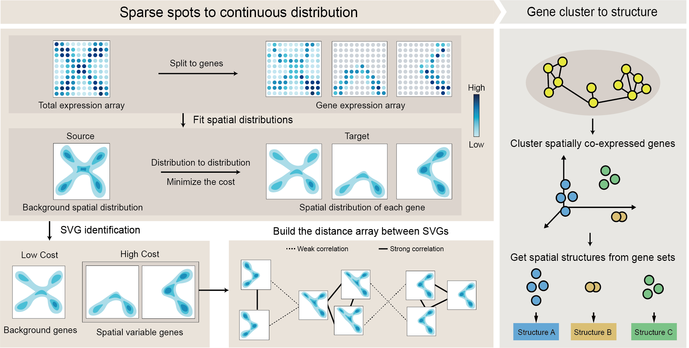

 


<div align=center></div>

# Introduction

Spatial transcriptomics revolutionizes transcriptomics by incorporating positional information. However, an emergency
problem is to find out the gene expression pattern which can reveal the special region in tissue and find out the genes
only expression in those regions.



Here we propose “STMiner” based on the Gaussian mixture model to solve this problem. STMiner is a bottom-up methodology
algorithm. It is initiated by fitting a parametric model of gene spatial distributions and constructing a distance array
between them utilizing the Hellinger distance. Genes are clustered, thereby recognizing spatial co-expression patterns
across distinct gene classes.

Please visit [STMiner Documents](https://stminerdoc.readthedocs.io/en/latest/Introduction/Introduction.html) for
details.

## Quick start by example

### import package

```python
from STMiner.SPFinder import SPFinder
```

### Load data

```python
sp = SPFinder()
sp.read_h5ad(file='I://zebrafish/10X_Visium_hunter2021spatially_sample_C_data.h5ad')
```

### Preprocess and Fit GMM

```python
sp.fit_pattern(n_comp=20, min_cells=200, n_top_genes=1000)
```

Each GMM model has 20 components.

### build distance matrix & clustering

```python
sp.build_distance_array()
sp.cluster_gene(n_clusters=6, mds_components=20)
```

### Result & Visualization

The result are stored in **genes_labels**:

```python
spf.genes_labels
```

The output looks like the following:

|    | gene_id        | labels |
|----|----------------|--------|
| 0  | Cldn5          | 2      |
| 1  | Fyco1          | 2      |
| 2  | Pmepa1         | 2      |
| 3  | Arhgap5        | 0      |
| 4  | Apc            | 5      |
| .. | ...            | ...    |
| 95 | Cyp2a5         | 0      |
| 96 | X5730403I07Rik | 0      |
| 97 | Ltbp2          | 2      |
| 98 | Rbp4           | 4      |
| 99 | Hist1h1e       | 4      |

To visualize the patterns by heatmap:

```python
sp.plot.plot_pattern(vmax=99,
                     vote_rate=0.4,
                     heatmap=False,
                     s=4,
                     reverse_y=True,
                     reverse_x=True,
                     image_path='E://OneDrive - stu.xjtu.edu.cn/paper/cut_img.png',
                     rotate_img=True,
                     k=4,
                     aspect=0.55,
                     output_path='./')
```

To visualize the genes expression heatmap by labels:

```python
sp.plot.plot_genes(label=0, vmax=99)
```

### Attribute of STMiner Object

| Attribute            | Type         | Description                        |
|----------------------|--------------|------------------------------------|
| adata                | Anndata      | Anndata for loaded spatial data    |
| genes_patterns       | dict         | GMM model for each gene            |
| genes_distance_array | pd.DataFrame | Distance between each GMM          |
| genes_labels         | pd.DataFrame | Gene name and their pattern labels |
| kmeans_fit_result    | obj          | Result of k-means                  |
| mds_features         | pd.DataFrame | embedding features after MDS       |
