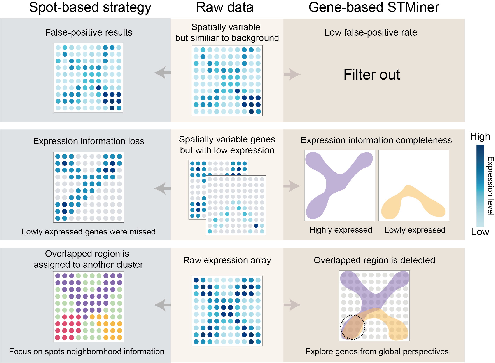
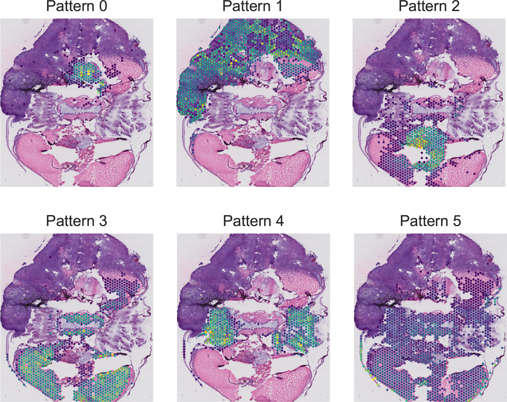

[](https://stminerdoc.readthedocs.io/en/latest/?badge=latest) 

<div align=center></div>

# Introduction
## Why STMiner?

ST data presents challenges such as uneven cell density distribution, low sampling rates, and complex spatial structures. Traditional spot-based analysis strategies struggle to effectively address these issues. STMiner explores ST data by leveraging the spatial distribution of genes, thus avoiding the biases that these conditions can introduce into the results.

<div align=center></div>

<br>

## Method detail
Here we propose “**STMiner**”. The three key steps of analyzing ST data in STMiner are depicted. 

<div align=center></div>

(**Left top**) STMiner first utilizes Gaussian Mixture Models (GMMs) to represent the spatial distribution of each gene and the overall spatial distribution. (**Left bottom**) STMiner then identifies spatially variable genes by calculating the cost that transfers the overall spatial distribution to gene spatial distribution. Genes with high costs exhibit significant spatial variation, meaning their expression patterns differ considerably across different regions of the tissue. The distance array is built between SVGs in the same way, genes with similar spatial structures have a low cost to transport to each other, and vice versa. (**Right**) The distance array is embedded into a low-dimensional space by Multidimensional Scaling, allowing for clustering genes with similar spatial expression patterns into distinct functional gene sets and getting their spatial structure. 


# Quick start by example
**Please visit [STMiner Documents](https://stminerdoc.readthedocs.io/en/latest/Introduction/Introduction.html) for installation and detail usage.**

## import package

```python
from STMiner import SPFinder
```

## Load data

You can download the demo dataset from [GEO](https://www.ncbi.nlm.nih.gov/geo/query/acc.cgi?acc=GSM4838133), or you can also download them from [STMOMICS](https://db.cngb.org/stomics/datasets/STDS0000086).
STMiner can read spatial transcriptome data in various formats, such as **gem**, **bmk**, and **h5ad** (see [STMiner Documents](https://stminerdoc.readthedocs.io/en/latest/Introduction/Introduction.html)). We recommend using the **h5ad** format, as it is currently the most widely used and supported by most algorithms and software in the spatial transcriptomics field.

```python
sp = SPFinder()
file_path = 'Path/to/your/h5ad/file'
sp.read_h5ad(file=file_path, bin_size=1)

```
The parameter **bin_size** specifies the size of merged cells (spots). If not specified, no merging is performed. If set to 50, 50x50 cells/spots will be merged into a single cell/spot. Due to low sequencing depth in some datasets, cells/spots are often merged during analysis (e.g., stereo-seq). However, 10x data typically does not require merging.

## Find spatial high variable genes

```python
sp.get_genes_csr_array(min_cells=500, log1p=False)
sp.spatial_high_variable_genes()
```

You can check the distance of each gene by:

```python
sp.global_distance
```

| Gene  | Distance |
|-------|----------|
| geneA | 9998     |
| geneB | 9994     |
| ...   | ...      |
| geneC | 8724     |

The first column is the gene name, and the second column is the difference between the spatial distribution of the gene and the background.</br>
A larger difference indicates a more pronounced spatial pattern of the gene.

## Preprocess and Fit GMM

```python
sp.fit_pattern(n_comp=20, gene_list=list(sp.global_distance[:1000]['Gene']))
```

**n_comp=20** means each GMM model has 20 components.

## Build distance matrix & clustering

```python
# This step calculates the distance between genes' spatial distributions.
sp.build_distance_array()
# Dimensionality reduction and clustering.
sp.cluster_gene(n_clusters=6, mds_components=20) 
```

## Result & Visualization

The result is stored in **genes_labels**:

```python
sp.genes_labels
```

The output looks like the following:

|    | gene_id        | labels |
|----|----------------|--------|
| 0  | Cldn5          | 2      |
| 1  | Fyco1          | 2      |
| 2  | Pmepa1         | 2      |
| 3  | Arhgap5        | 0      |
| 4  | Apc            | 5      |
| .. | ...            | ...    |
| 95 | Cyp2a5         | 0      |
| 96 | X5730403I07Rik | 0      |
| 97 | Ltbp2          | 2      |
| 98 | Rbp4           | 4      |
| 99 | Hist1h1e       | 4      |

### Visualize the distance array:

```python
import seaborn as sns
sns.clustermap(sp.genes_distance_array)
```
<div align=center></div>

### To visualize the patterns:
Note: A cutting border of the original dataset is needed to better visualize images. Anyhow, you can download the processed image [here](https://github.com/xjtu-omics/STMiner/blob/main/pic/demo_img.png).

```python
sp.get_pattern_array(vote_rate=0.3)
img_path = 'path/to/downloaded/image'
sp.plot.plot_pattern(vmax=99,
                     heatmap=False,
                     s=5,
                     reverse_y=True,
                     reverse_x=True,
                     image_path=img_path,
                     rotate_img=True,
                     k=4,
                     aspect=0.55)
```

<div  align="center">    
  
</div>

### Visualize the intersections between patterns 3 & 1:

```python
sp.plot.plot_intersection(pattern_list=[0, 1],
                          image_path=img_path,
                          reverse_y=True,
                          reverse_x=True,
                          aspect=0.55,
                          s=20)
```

<div  align="center">    
  
</div>

### To visualize the gene expression by labels:

```python
sp.plot.plot_genes(label=0, vmax=99)
```

## Attributes of STMiner.SPFinder Object

| Attribute            | Type         | Description                             |
|----------------------|--------------|-----------------------------------------|
| adata                | Anndata      | Anndata for loaded spatial data         |
| global_distance      | pd.DataFrame | OT distance between gene and background |
| genes_labels         | pd.DataFrame | Gene name and their pattern labels      |
| genes_patterns       | dict         | GMM model for each gene                 |
| genes_distance_array | pd.DataFrame | Distance between each GMM               |
| kmeans_fit_result    | obj          | Result of k-means                       |
| mds_features         | pd.DataFrame | embedding features after MDS            |

# Contact
 - Peisen Sun (sunpeisen@stu.xjtu.edu.cn)
 - Kai Ye (kaiye@xjtu.edu.cn)
